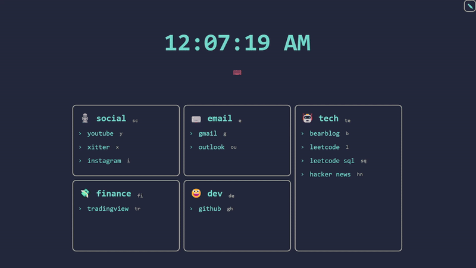
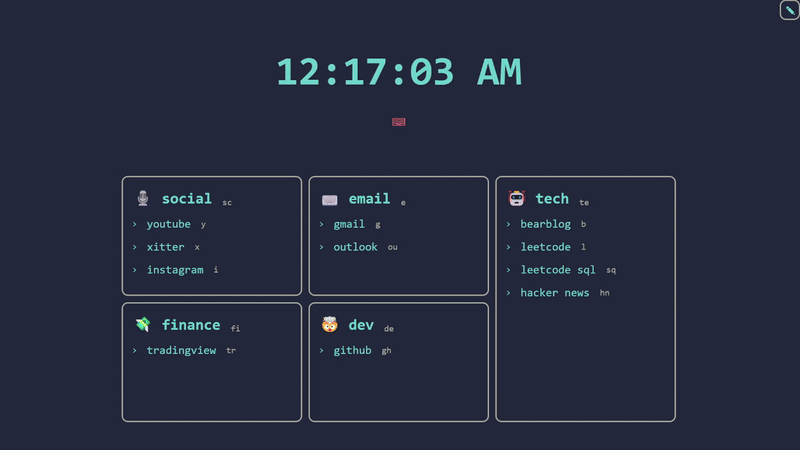
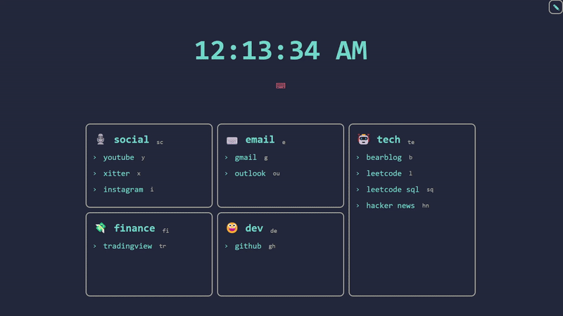

# launchtab

CURRENTLY IN TESTING PHASE, RELEASE SOON

**New tab replacement for quick link navigation using VIM-style keychords.**
_Quickly go to links by matching user input to key combinations or press links directly._

For Chromium-based browsers.
[Chrome Web Store Link.](https://chromewebstore.google.com/)

## Features:

- Create and manage links into categories
- Highly personalizable through a graphical UI
- Custom styling and font settings
- Import and export data

## Guide:

- **Grid -> Nodes -> Links**: logical hierarchy of data

  - the grid has a dimension of n\*m nodes
  - nodes have a list of links and represents a category
  - links can be pressed on or selected via keychords

- **Edit Mode**: press the edit button on the top right to enable edit mode
  - create/edit nodes and links
  - drag and drop links within or to other nodes
  - enables settings modal
    - adjust grid dimensions and css styling
    - import/export settings and node data

- **Keychord Navigation**: when creating a new tab, the address bar is focused
  - press ESC, and launchtab can listen to user input to match to keychords
  - once user input matches node keychord + link keychord:
    - the selected link will be previewed
    - pressing enter will redirect to that selected link
    - pressing enter with no selected link, clears user input

## About:

- Built using React + TS
